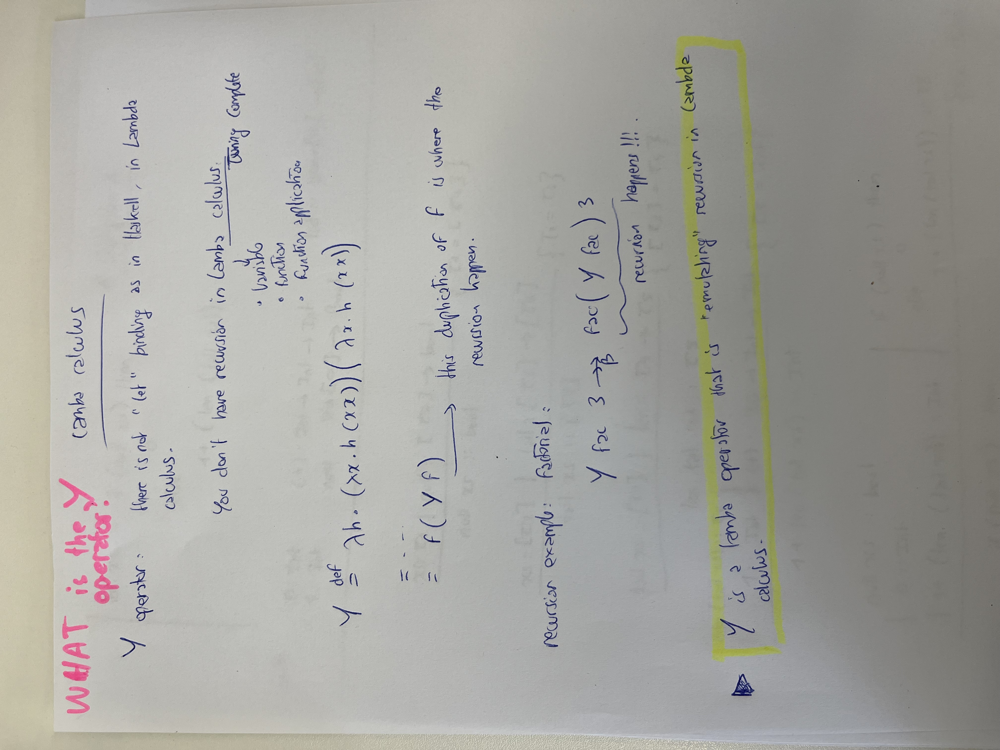

# Lambda calculus

The lecture introduced the fixed-point operator Y , which satisfies Y f =β f (Y f ), but not Y f ↠β f (Y f ). In other words, it is not possible to go from Y f to f (Y f ) with β-reductions alone, on has to perform one β-reduction “backwards”, i.e, formally, Y has the property that there is a λ-term t which satisfies Y f ↠β t und f (Y f ) →β t.

Show (by performing the necessary β-reductions) that the λ-term Z = V V with V = λz x . x (z z x ) has the property Z f ↠β f (Z f ).

> Y was discovered Haskell B. Curry, Z by Alan Turing.

We want to prove that:
Z f ↠β f (Z f )

We have:
Z =per_definition= V V

Z =per_definition= (λz x . x (z z x)) (λz x . x (z z x))

So:

 Z f = V V f = (λz x . x (z z x)) V f = (λz. (λx. x (z z x))) f

 →β (λx. x (z z x)) [z := V] f 

 <u>(λx. x (V V x)) f</u> 

 →β (x (V V x)) [x := f] 

 = f (V V f) = f (Z f)

Proof done.
