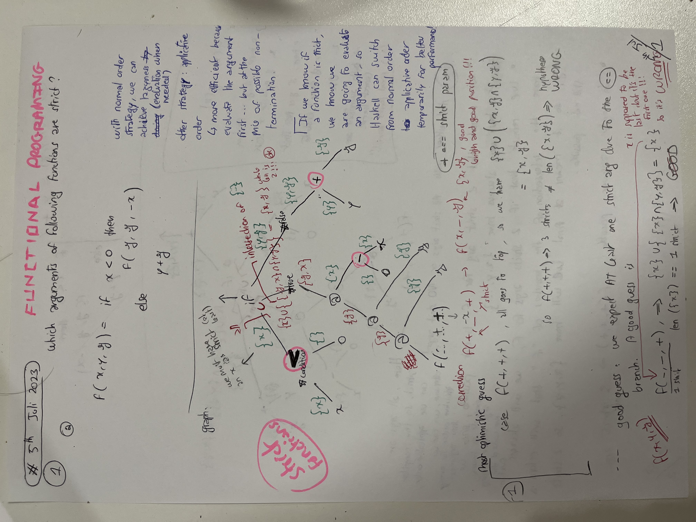
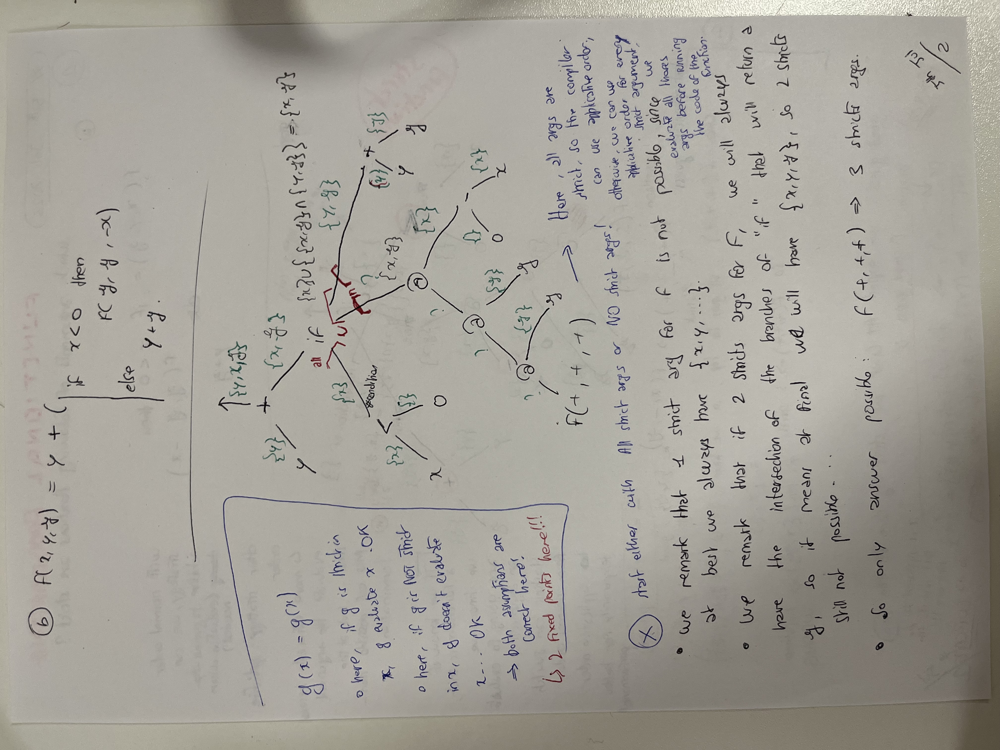
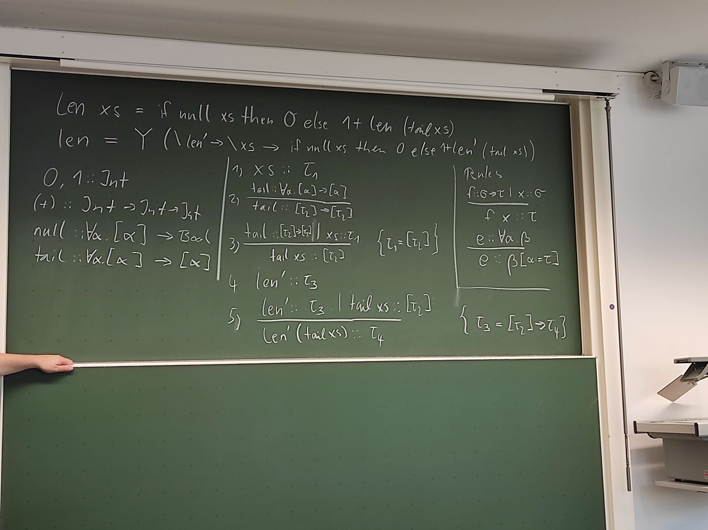

# Problem 1 (Strictness Analysis)

Determine (using the method shown in the lecture) in which arguments the following functions are
strict. Assume that the functions <, +, − are strict in all their arguments.

### (a) f (x,y,z) = if x<0 then f (z,z,-x) else y+z

### (b) f (x,y,z) = y + (if x<0 then f (z,z,-x) else y+z)

> see sheets...

### Teacher correction

